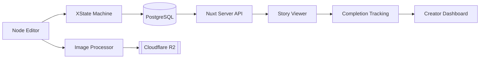
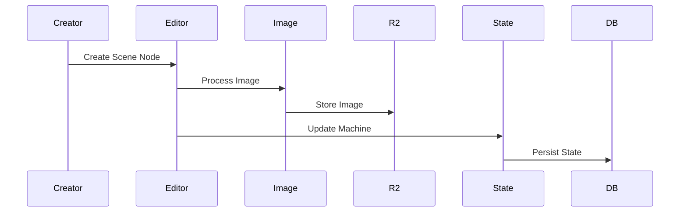

# System Architecture & Patterns

## Core System Architecture



## Key Components

### 1. Node Editor
- Vue Flow integration for visual programming
- Scene node management
- Edge connections for progression
- Real-time state updates

### 2. State Management
- XState machines for story flow
- JSON-based state persistence
- Scene transition logic
- Progress tracking

### 3. Image Processing
- AI generation pipeline
- Upload handling
- Cloudflare R2 storage
- Image optimization

### 4. Story Consumption
- Progressive scene rendering
- Choice-based navigation
- State machine execution
- Completion tracking

### 5. Analytics System
- Per-story statistics
- Completion notifications
- Viewer tracking
- Engagement metrics

## Data Flow Patterns

### Story Creation


### Story Consumption


## State Machine Structure


## Design Patterns

1. **Node-Based Editor**
   - Drag-and-drop interface
   - Visual connection mapping
   - Real-time preview
   - State validation

2. **State Machine Serialization**
   - JSON structure
   - Version control
   - Migration support
   - Validation rules

3. **Image Management**
   - Async processing
   - Optimized storage
   - Caching strategy
   - Format standardization

4. **Analytics Pipeline**
   - Event streaming
   - Aggregation rules
   - Real-time updates
   - Data persistence

## Implementation Guidelines

1. **Scene Node Structure**
   ```typescript
   interface SceneNode {
     id: string;
     type: 'scene';
     position: { x: number; y: number };
     data: {
       image: string;
       options: ProgressionOption[];
     };
   }
   ```

2. **State Machine Format**
   ```typescript
   interface StoryMachine {
     id: string;
     version: string;
     initial: string;
     states: Record<string, SceneState>;
     context: StoryContext;
   }
   ```

3. **Analytics Events**
   ```typescript
   interface CompletionEvent {
     storyId: string;
     userId: string;
     path: string[];
     duration: number;
     timestamp: string;
   }
